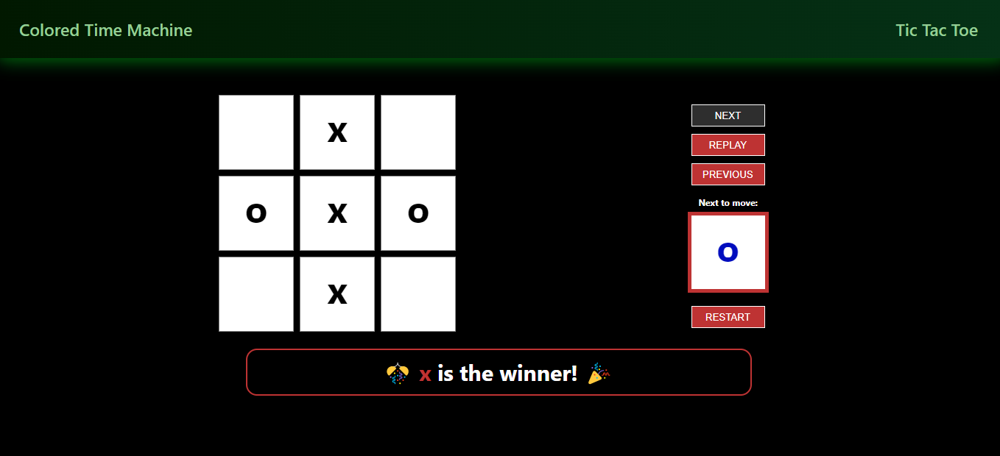
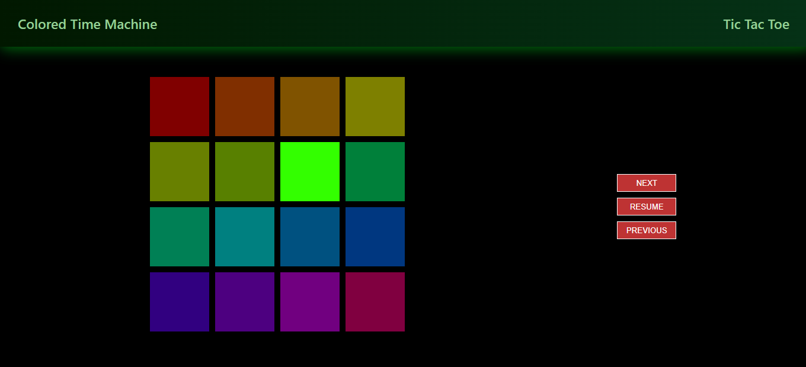

# TIC TAC TOE & TIME COLORED MACHINE

## Description

This project consists of two games. The first one is a grid which user can click over them and the app will track all the elements which the user clicked. The second one is the tic tac toe game.

## Technologies

This project was built using React, React Router Dom, TypeScript and SASS.

## Screenshots

## How to try it locally

The first step is to clone the project and install dependencies with `npm install`.  
 
Now you are ready to execute the command `npm start` and to see the project in the localhost.

## Deploy

You can visit the deployed project <a href='https://tictactoe-peach-ten.vercel.app/'>here</a>.

# ABOUT ME

## Portfolio

You can visit my portfolio to see other projects I have worked on <a href='https://portfolio-nicolasmilitello.vercel.app/'>here</a>.

## Contact

You can find more about me in my LinkedIn profile <a href='https://www.linkedin.com/in/nicolas-militello-full-stack/'>here</a>.
